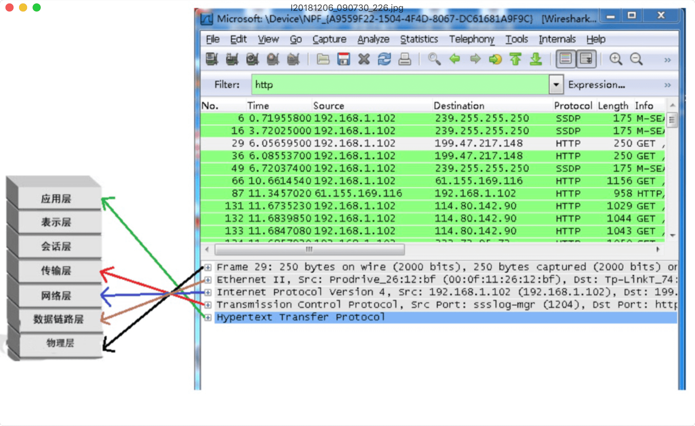
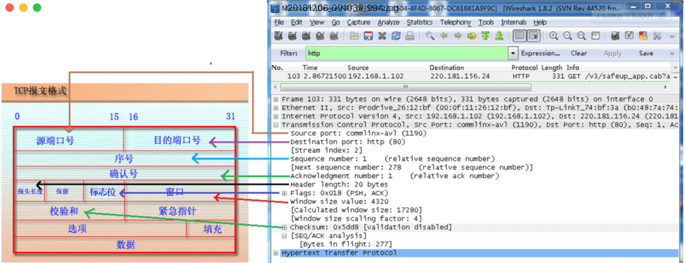
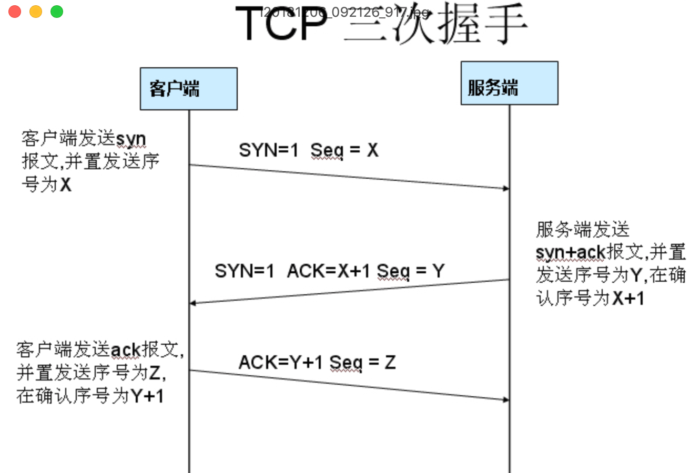
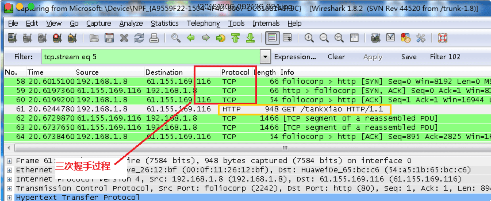
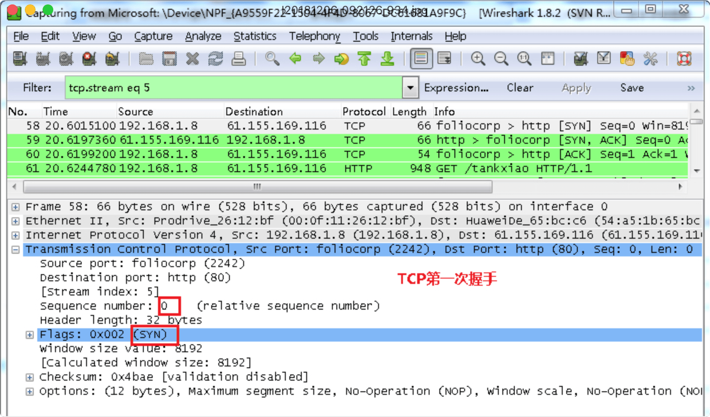
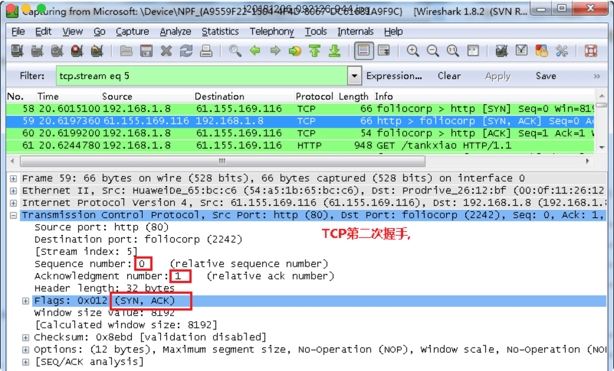
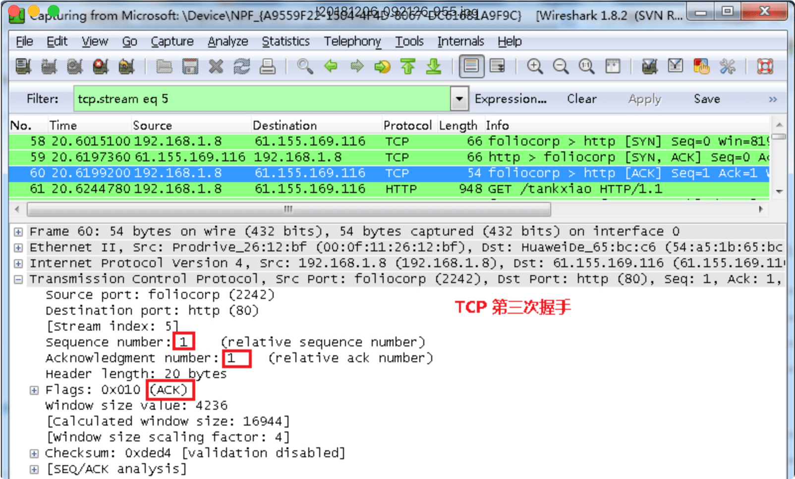

一款直接连接网卡抓取封包的软件，能够与网络近距离接触。

# 选取需要抓包的网卡

点击 Caputre->Interfaces..选择正确的网卡。然后点击"Start"按钮, 开始抓包

# Display Filter(显示过滤器)

显示捕获到的封包， 有源地址和目标地址，端口号。

## 协议过滤

比如 TCP，只显示 TCP 协议。

## IP 过滤

比如 ip.src==192.168.1.102 显示源地址为 192.168.1.102，

ip.dst==192.168.1.102, 目标地址为 192.168.1.102

## 端口过滤

tcp.port==80, 端口为 80 的

tcp.srcport==80, 只显示 TCP 协议的原端口为 80 的。

## Http 模式过滤

http.request.method=="GET", 只显示 HTTP GET 方法的。

## 逻辑运算符为

and/or

ip.src==192.168.1.102 or ip.dst==192.168.1.102

# Packet List Pane(封包列表)

封包列表的面板中显示，编号，时间戳，源地址，目标地址，协议，长度，以及封包信息。 你可以看到不同的协议用了不同的颜色显示。

显示封包中的字段

# Packet Details Pane(封包详细信息)

## Frame

物理层的数据帧概况

## Ethernet II

数据链路层以太网帧头部信息

## Internet Protocol Version 4

互联网层 IP 包头部信息

## Transmission Control Protocol(TCP)

传输层 T 的数据段头部信息，此处是 TCP

### 三次握手过程

在 wireshark 中输入 http 过滤， 然后选中 GET /tankxiao HTTP/1.1 的那条记录，右键然后点击"Follow TCP Stream"

## Hypertext Transfer Protocol

应用层的信息，此处是 HTTP 协议

# Dissector Pane

16 进制数据

参考地址：<https://blog.csdn.net/sinat_32176267/article/details/78297361>
