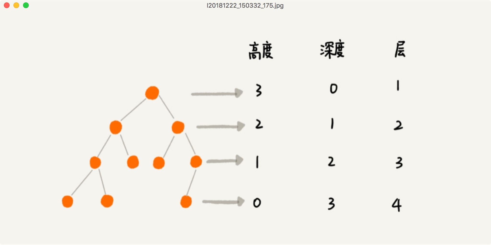
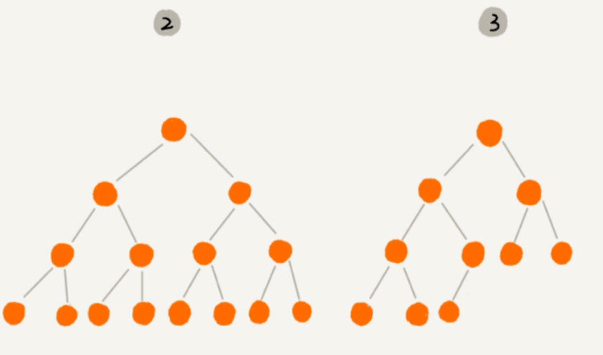
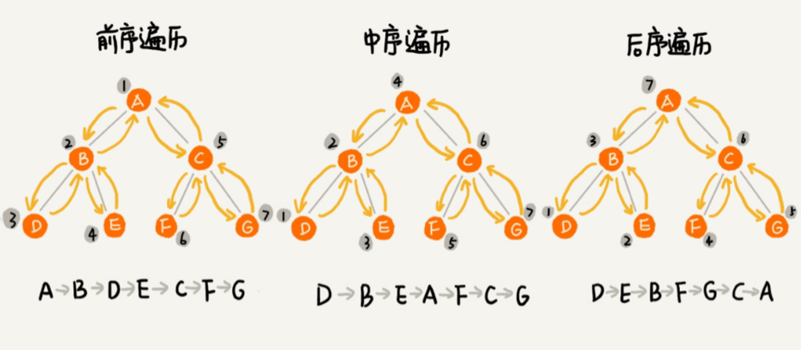
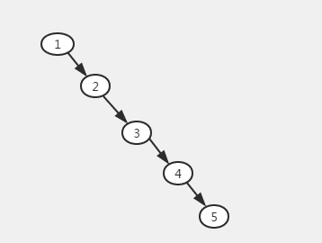
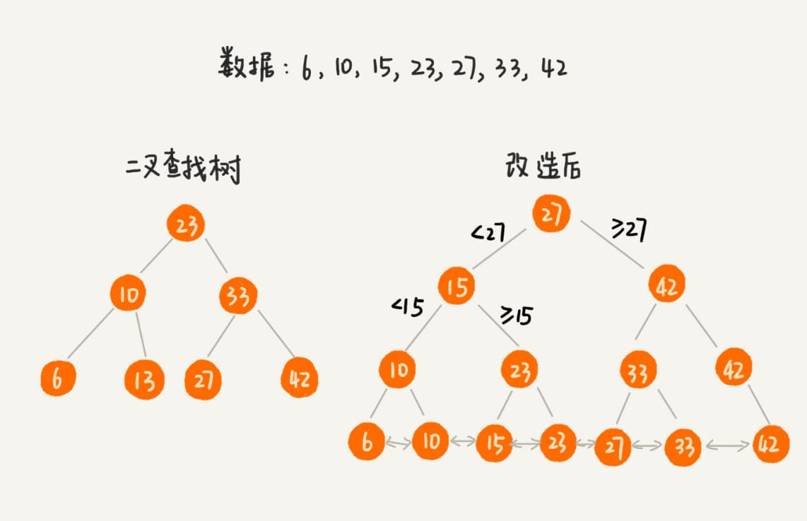
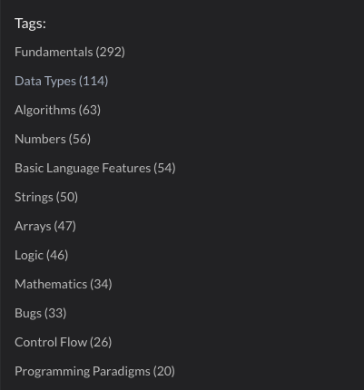

# 大话数据结构

---

## 数据结构

- 数据结构就是以某种特定的布局存储数据
- 这个布局使得某些操作非常高些，另外一些操作不那么高效
- 理解数据结构，就能为手头问题选择最优的数据结构

---

## 算法

**算法是解决特定问题求解步骤的描述**

---

## 存储结构

- 顺序存储结构

  - 在内存地址中连续存储
  - 建立定长数组，计算机在内存中开辟连续空间

- 链式存储结构

  - 存储单元可连续可不连续，存放的是指针地址，通过地址就能找到关联数据
  - 单线联系，断了就找不到了

 <!--《无间道》里面梁朝伟是警方在黑社会的卧底，一直与黄秋生进行单线联系，黄秋生遇害后梁朝伟就无法证明自己是一个警察，所以最后梁朝伟指着刘德华说：“对不起，我是警察”的是偶，刘德华马上说：“谁知道呢？”-->

---

## 数组

- 误区

  - 数组是适合查找操作，但是查找的时间复杂度并不为 O(1)，即便是排好序的数组，你用二分查找，时间复杂度也是 O(logn)
  - 正确的表述应该是，数组支持随机访问，根据下标随机访问的时间复杂度为 O(1)

- 数组下标为什么从 0 开始

  - 从数组存储的内存模型上来看，下标最确切的定义应该是偏移（offset）
  - 如果用 a 来表示数组的首地址，`a[0]` 就是偏移为 0 的位置，也就是首地址，`a[k]` 就表示偏移 k 个 type_size 的位置：`a[k]_address = base_address + k * type_size`

---

## 栈

- 栈既可以用数组来实现，也可以用链表来实现

  - 用数组实现的栈，叫作顺序栈
  - 用链表实现的栈，叫作链式栈

- 应用

  - `Array.push` 和 `Array.pop` 就是栈，可以在线上直接使用，时间复杂度是 O(1)
  - 浏览器前进后退、Blockly 的撤销重做，就是通过两个栈来做记录

---

## 队列

- 基本操作

  - Enqueue() - 向队列末尾插入元素
  - Dequeue() - 从队列头部移除元素
  - isEmpty() - 如果队列为空，则返回 true
  - Top() - 返回队列的第一个元素

- JS 中的队列

  - `Array.shift` 出队的时间复杂度是 O(n)，线上项目不可直接使用（误），因此需要实现一个 `Queue` 队列，以实现 O(1) 的时间复杂度

---

### 队列 JS 实现

```js
class Queue {
  constructor(max) {
    this.data = new Array(max);this.q = 0;
    this.p = 0;this.size = 0;this.max = max;
  }
  enqueue(item) {
    if (this.size === this.max) { throw; } // overflow
    this.data[this.p++] = item;
    this.size++;
    if (this.p === this.max) {
      this.p = 0;
    }
  }
  dequeue() {
    if (this.size === 0) { throw; } // underflow
    const item = this.data[this.q++];
    this.size--;
    if (this.q === this.max) {
      this.q = 0;
    }
    return item;
  }
}
```

---

### 优先队列

- 优先级最高的元素优先出队，实现是入队时插入到对的位置
- 测试用例

```js
const PriorityQueue = require("../PriorityQueue");

describe("PriorityQueue", () => {
  it("enqueue", () => {
    const priorityQueue = new PriorityQueue();
    priorityQueue.enqueue("John", 2);
    priorityQueue.enqueue("Jack", 1);
    priorityQueue.enqueue("Camila", 3);
    expect(priorityQueue.print()).toBe("3-Camila->2-John->1-Jack");
  });
});
```

---

优先队列核心逻辑

```js
  enqueue(element, priority) {
    const queueElement = new QueueElement(
      element,
      priority,
    );
    let added = false;
    for (let i = 0; i < this.items.length; i++) {
      if (queueElement.priority >= this.items[i].priority) {
        this.items.splice(i, 0, queueElement);
        added = true;
        break;
      }
    }

    if (!added) {
      this.items.push(queueElement);
    }
  }
```

---

## 链表

- 数组中插入或者移除项的成本过高

  - splice(start, deleteCount, item1, item2, ...) 时间复杂度 O(n)

- 在链表中删除数据

  - 删除结点中“值等于某个给定值”的结点，从头开始遍历，查找的时间复杂度是 O(n)
  - 删除给定指针指向的结点，双链表因为保存了前驱和后驱指针，所以只需要 O(1) 的时间复杂度

---

链表的用法一

```js
it("append", () => {
  const list = new LinkedList();
  list.append(1);
  list.append(2);
  list.append(3);
  list.append(4);
  list.append(5);
  expect(list.toString()).toBe("1->2->3->4->5");
});

it("insert", () => {
  const list = new LinkedList();
  list.insert(0, 1);
  list.insert(1, 2);
  list.insert(2, 3);
  list.insert(1, 4);
  expect(list.toString()).toBe("1->4->2->3");
});
```

---

链表的用法二

```js
it("removeAt", () => {
  const list = new LinkedList();
  list.append(1);
  list.append(2);
  list.append(3);
  list.append(4);
  list.append(5);
  list.removeAt(3);
  expect(list.toString()).toBe("1->2->3->5");
});

it("remove", () => {
  const list = new LinkedList();
  list.append(1);
  list.append(2);
  list.append(3);
  list.append(4);
  list.append(5);
  list.remove(3);
  expect(list.toString()).toBe("1->2->4->5");
});
```

---

链表的用法三

```js
it("indexOf", () => {
  const list = new LinkedList();
  list.append(1);
  list.append(2);
  list.append(3);
  list.append(4);
  list.append(5);
  expect(list.indexOf(3)).toBe(2);
});

it("reverse", () => {
  const list = new LinkedList();
  list.append(1);
  list.append(2);
  list.append(3);
  list.append(4);
  list.append(5);
  list.reverse();
  expect(list.toString()).toBe("5->4->3->2->1");
});
```

---

### 链表的数据结构

```js
// 链表项
class Node {
  constructor(element) {
    this.element = element;
    this.next = null;
  }
}

// 链表容器
class LinkedList {
  constructor() {
    this.length = 0;
    this.head = null;
  }
}
```

---

### 插入操作图示


---

### 插入操作代码

```js
append(element) {
  const node = new Node(element);
  let curr;

  if (this.head === null) {
    this.head = node;
    this.length++;
    return;
  }

  curr = this.head;
  // 循环找到列表的最后一项
  while(curr.next) {
    curr = curr.next;
  }

  curr.next = node;
  this.length++;
}
```

---

### 反转链表

- 画图帮助理解
- 训练解决多个链接关系的思路、例如爬楼梯问题

```js
reverse() {
  let curr = this.head;
  let prev = null;
  let next = null;
  while(curr) {
    next = curr.next;
    curr.next = prev;
    prev = curr;
    curr = next;
  }
  this.head = prev;
}
```

---

### 双向链表图示


---

### 双向链表数据结构

```js
class Node {
  constructor(element) {
    this.element = element;
    this.next = null;
    this.prev = null; // 比单链表多出来的属性
  }
}

class DoublyLinkedList {
  constructor() {
    this.length = 0;
    this.head = null;
    this.tail = null; // 比单链表多出来的属性
  }
}
```

---

## 散列表

- 散列表又称为哈希表
- 散列表表用的是数组支持按照下标随机访问数据的特性，所以散列表其实就是数组的一种扩展，由数组演化而来，如果没有数组，就没有散列表
- 散列表是动态集合结构中查找一个元素时间最短的

---

### 散列表性能

- 散列函数
- 散列表的大小
- 碰撞处理方法

---

### 散列函数

散列函数可以定义成 hash(key)，其中 key 表示元素的键值，hash(key) 的值表示经过散列函数计算得到的散列值:

- 散列函数计算得到的散列值是一个非负整数, 因为数组下标是从 0 开始的，所以散列函数生成的散列值也要是非负整数
- 如果 key1 = key2，那 hash(key1) == hash(key2)
- 如果 key1 ≠ key2，那 hash(key1) ≠ hash(key2)

---

### 散列表数据结构

```js
class HashTable {
  constructor() {
    this.table = [];
  }

  djb2HashCode(key) {
    let hash = 5381; // 一个较大的素数基准值
    for (let i = 0; i < key.length; i++) {
      hash = hash * 33 + key.charCodeAt(i);
    }
    return hash % 1013; // 除以1013取余
  }

  put(key, value) {}

  get(key) {}

  remove(key) {}
}
```

---

### 散列冲突解决

- 更好的散列函数
  - 一个表现良好的散列函数应该有较好的插入和查找性能且有较低的冲突可能性
- 线性探查
  - 线性探查法在向散列表中插入元素时，如果插入位置 position 已经被占据，就尝试插入 position+1 的位置，以此类推，直到找到空的位置
- 链表法
  - 在散列表中，每个桶（bucket）或者槽（slot）会对应一条链表，所有散列值相同的元素我们都放到相同槽位对应的链表中
  - 当插入的时候，我们只需要通过散列函数计算出对应的散列槽位，将其插入到对应链表中即可，所以插入的时间复杂度是 O(1)

---

## 布隆过滤器

- 判断假永远是假，真不一定是真
- 原理是当一个元素被加入集合时，通过 K 个散列函数将这个元素映射成一个位数组中的 K 个点，把它们置为 1。检索时，我们只要看看这些点是不是都是 1 就（大约）知道集合中有没有它了：如果这些点有任何一个 0，则被检元素一定不在；如果都是 1，则被检元素很可能在。这就是布隆过滤器的基本思想
- 我们用布隆过滤器来记录已经爬取过的网页链接，假设需要判重的网页有 10 亿，那我们可以用一个 10 倍大小的位图来存储，也就是 100 亿个二进制位，换算成字节，那就是大约 1.2GB。之前我们用散列表判重，需要至少 100GB 的空间。相比来讲，布隆过滤器在存储空间的消耗上，降低了非常多

---

[布隆过滤器实现](https://github.com/trekhleb/javascript-algorithms/blob/master/src/data-structures/bloom-filter/BloomFilter.js)

---

## 树

### 基本概念

- 节点：树中的每个元素都叫做节点
- 根节点：位于树顶顶部的节点，它没有父节点
- 内部节点：至少有一个子节点的节点
- 叶子节点：没有子元素的节点
- 高度：从 0 开始，根节点最高
- 深度：从 0 开始，根节点为 0
- 层数：从 1 开始，根节点为 1
- 满二叉树：叶子节点全都在最底层，除了叶子节点之外，每个节点都有左右两个子节点。
- 完全二叉树：叶子节点都在最底下两层，最后一层的叶子节点都靠左排列，并且除了最后一层，其他层的节点个数都要达到最大

---

### 高度、深度、层数



---

### 满二叉树、完全二叉树

完全二叉树：叶子节点都在最底下两层，最后一层的叶子节点都靠左排列，并且除了最后一层，其他层的节点个数都要达到最大



---

### 二叉树的遍历



---

前序遍历：根 => 左 => 右

```js
function preOrder(node) {
  if (node == undefined) {
    return [];
  }
  return [node.data].concat(preOrder(node.left)).concat(preOrder(node.right));
}
```

---

中序遍历：左 => 根 => 右

如果是二叉查找树，得到的就是有序的数据

```js
function inOrder(node) {
  if (node == undefined) {
    return [];
  }
  return inOrder(node.left).concat(node.data).concat(inOrder(node.right));
}
```

---

后序遍历：左 => 右 => 根

```js
function postOrder(node) {
  if (node == undefined) {
    return [];
  }
  return postOrder(node.left).concat(postOrder(node.right)).concat([node.data]);
}
```

---

### 二叉查找树

- 实现 O(logn) 的查找效率
- 别称：二叉搜索树、有序二叉树、排序二叉树
- 左子树上所有节点的值均小于它的根节点的值
- 右子树上所有节点的值均大于它的根节点的值
- 左右子树也分别为二叉查找树

---

#### 二叉查找树数据结构

```js
// 节点
class Node {
  constructor(key) {
    this.key = key;
    this.left = null;
    this.right = null;
  }
}

// 树
class BinarySearchTree {
  constructor() {
    // 和 LinkedList 类似，不过这里是根元素，不是头节点
    this.root = null;
  }
}
```

---

#### 二叉查找树 - 插入

```js
_insertNode(node, newNode) {
  if (newNode.key < node.key) {
    if (node.left === null) {
      node.left = newNode;
    } else {
      this._insertNode(node.left, newNode);
    }
  } else {
    if (node.right === null) {
      node.right = newNode;
    } else {
      this._insertNode(node.right, newNode);
    }
  }
}
```

---

#### 二叉查找树 - 查找一个 key 是否存在

```js
_searchNode(node, key) {
  if (node === null) {
    return false;
  }
  if (key < node.key) {
    return this._searchNode(node.left, key);
  }
  if (key > node.key) {
    return this._searchNode(node.right, key);
  }
  return true;
}
```

---

#### 二叉查找树 - 中序遍历

```js
_inOrderTraverseNode(node, cb) {
  if (node === null) {
    return;
  }

  this._inOrderTraverseNode(node.left, cb);
  cb(node.key);
  this._inOrderTraverseNode(node.right, cb);
}
```

---

#### 二叉查找树 - 先序遍历

```js
_preOrderTraverseNode(node, cb) {
  if (node === null) {
    return;
  }

  cb(node.key);
  this._preOrderTraverseNode(node.left, cb);
  this._preOrderTraverseNode(node.right, cb);
}
```

---

#### 二叉查找树 - 后序遍历

```js
_postOrderTraverseNode(node, cb){
  if (node === null) {
    return;
  }

  this._postOrderTraverseNode(node.left, cb);
  this._postOrderTraverseNode(node.right, cb);
  cb(node.key);
}
```

---

#### 二叉查找树 - 返回树中最小值

```js
_minNode(node) {
  if (!node) {
    return null;
  }

  while (node && node.left !== null) {
    node = node.left;
  }

  return node.key;
}
```

---

#### 二叉查找树 - 返回树中最大值/键

```js
_maxNode(node) {
  if (!node) {
    return null;
  }

  while (node && node.right) {
    node = node.right;
  }

  return node.key;
}
```

---

#### 二叉查找树 - 从树中移除某个键

```js
_removeNode(node, key) {
  if (node === null) {
    return null;
  }
  if (key < node.key) {
    node.left = this._removeNode(node.left, key);
    return node; // 给父节点提供指针指向
  } else if (key > node.key) {
    node.right = this._removeNode(node.right, key);
    return node; // 给父节点提供指针指向
  } else {
      /**
       * 如果找到了 key === node.key，就要处理三种情况
       * 1. 叶子节点
       * 2. 只有左节点或者只有右节点的节点
       * 3. 有两个子节点的节点
      */
  }
}
```

---

#### 二叉查找树 - 从树中移除某个键

[\_removeNode 完整代码](https://static.chenng.cn/#/%E6%95%B0%E6%8D%AE%E7%BB%93%E6%9E%84%E4%B8%8E%E7%AE%97%E6%B3%95/%E6%95%B0%E6%8D%AE%E7%BB%93%E6%9E%84%E4%B8%8E%E7%AE%97%E6%B3%95?id=%E4%BA%8C%E5%8F%89%E6%9F%A5%E6%89%BE%E6%A0%91)

---

#### 二叉查找树 - 支持重复数据的两种方法

- 二叉查找树中每一个节点不仅会存储一个数据，会通过链表和支持动态扩容的数组等数据结构，把值相同的数据都存储在同一个节点上
- 每个节点仍然只存储一个数据。在查找插入位置的过程中，如果碰到一个节点的值，与要插入数据的值相同，我们就将这个要插入的数据放到这个节点的右子树，把这个新插入的数据当作大于这个节点的值来处理。当要查找数据的时候，遇到值相同的节点，我们并不停止查找操作，而是继续在右子树中查找，直到遇到叶子节点，才停止。这样就可以把键值等于要查找值的所有节点都找出来

---

#### 二叉树查找树与散列表对比

- 散列表中的数据是无序存储的，如果要输出有序的数据，需要先进行排序；而对于二叉查找树来说，我们只需要中序遍历，就可以在 O(n) 的时间复杂度内，输出有序的数据序列（[06.png](./imgs/06.png)）
- - 散列表扩容耗时很多，而且当遇到散列冲突时，性能不稳定，尽管二叉查找树的性能不稳定，但是在工程中，我们最常用的平衡二叉查找树的性能非常稳定，时间复杂度稳定在 O(logn)
- 尽管散列表的查找等操作的时间复杂度是常量级的，但因为哈希冲突的存在，这个常量不一定比 logn 小，所以实际的查找速度可能不一定比 O(logn) 快。加上哈希函数的耗时，也不一定就比平衡二叉查找树的效率高
- 散列表的构造比二叉查找树要复杂，需要考虑的东西很多。比如散列函数的设计、冲突解决办法、扩容、缩容等。平衡二叉查找树只需要考虑平衡性这一个问题，而且这个问题的解决方案比较成熟、固定

---

### 平衡二叉树

- 二叉树中任意一个节点的左右子树的高度相差不能大于 1
- 完全二叉树、满二叉树其实都是平衡二叉树
- 非完全二叉树也有可能是平衡二叉树



极度不平衡的时候查找的复杂度就是 O(n) 了

---

### 堆

- 堆是一个完全二叉树，除了最后一层，其他层的节点个数都是满的，最后一层的节点都靠左排列
- 堆中每一个节点的值都必须大于等于（或小于等于）其子树中每个节点的值
- 堆中每个节点的值都大于等于（或者小于等于）其左右子节点的值
- 堆排序的时间复杂度是 O(n)

---

#### 堆的使用

- 优先级队列
  - 堆和优先级队列非常相似。一个堆就可以看作一个优先级队列。往优先级队列中插入一个元素，就相当于往堆中插入一个元素；从优先级队列中取出优先级最高的元素，就相当于取出堆顶元素
- 利用堆求 Top K
  - 每次询问前 K 大数据，我们都基于当前的数据重新排序的话，那时间复杂度就是 O(nlogK)，n 表示当前的数据的大小
  - 可以一直都维护一个 K 大小的小顶堆，当有数据被添加到集合中时，我们就拿它与堆顶的元素对比

---

#### 堆的实现

[javascript-algorithms-heap](https://github.com/trekhleb/javascript-algorithms/blob/master/src/data-structures/heap/README.zh-CN.md)

---

### B+ 树

该用什么数据结构实现下面的查找需求？

```sql
-- 根据某个值查找数据
select * from user where id=1234

-- 根据区间值来查找某些数据
select * from user where id > 1234 and id < 2345
```

---

#### Mysql 的查找需求：

- 散列表：查询性能很好，时间复杂度是 O(1)，散列表不能支持按照区间快速查找数据
- 平衡二叉查找树：查询的时间复杂度是 O(logn)，对树进行中序遍历，我们还可以得到一个从小到大有序的数据序列，但这不足以支持按照区间快速查找数据

---

#### 改造二叉查找树

- 让二叉查找树支持按照区间来查找数据
- 树中的节点并不存储数据本身，而是只是作为索引
- 把每个叶子节点串在一条链表上，链表中的数据是从小到大有序的

---



---

#### 使用 B+ 树

- 我们只需要拿区间的起始值，在树中进行查找
- 当查找到某个叶子节点之后，我们再顺着链表往后遍历，直到链表中的结点数据值大于区间的终止值为止
- 所有遍历到的数据，就是符合区间值的所有数据

---

## 数据结构练习 - Leetcode

- 数组和链表
- 栈、队列和递归
- 排序和二分查找
- 散列表和字符串
- 二叉树和堆
- 贪心、分治、回溯和动态规划

---

### 数组和链表

- [Three Sum（求三数之和）](https://leetcode.com/problems/3sum/)
- [Majority Element（求众数）](https://leetcode.com/problems/majority-element/)
- [Missing Positive（求缺失的第一个正数）](https://leetcode.com/problems/first-missing-positive/)
- [Linked List Cycle I（环形链表）](https://leetcode.com/problems/linked-list-cycle/)
- [Merge k Sorted Lists（合并 k 个排序链表）](https://leetcode.com/problems/merge-k-sorted-lists/)

---

### 栈、队列和递归

- [Valid Parentheses（有效的括号）](https://leetcode.com/problems/valid-parentheses/)
- [Longest Valid Parentheses（最长有效的括号）](https://leetcode.com/problems/longest-valid-parentheses/)
- [Evaluate Reverse Polish Notatio（逆波兰表达式求值）](https://leetcode.com/problems/evaluate-reverse-polish-notation/)
- [Design Circular Deque（设计一个双端队列）](https://leetcode.com/problems/design-circular-deque/)
- [Sliding Window Maximum（滑动窗口最大值）](https://leetcode.com/problems/sliding-window-maximum/)
- [Climbing Stairs（爬楼梯）](https://leetcode.com/problems/climbing-stairs/)

---

### 排序和二分查找

- 实现归并排序、快速排序、插入排序、冒泡排序、选择排序
- 实现 O(n) 时间复杂度内找到一组数据的第 K 大元素
- [Sqrt(x) （x 的平方根）](https://leetcode.com/problems/sqrtx/)

---

### 散列表和字符串

- [实现一个 LRU 缓存淘汰算法](https://www.codewars.com/kata/53b406e67040e51e17000c0a)
- [Reverse String （反转字符串）](https://leetcode.com/problems/reverse-string/)
- [Reverse Words in a String（翻转字符串里的单词）](https://leetcode.com/problems/reverse-words-in-a-string/)
- [String to Integer (atoi)（字符串转换整数 (atoi)）](https://leetcode.com/problems/string-to-integer-atoi/)

---

### 二叉树和堆

- [Invert Binary Tree（翻转二叉树）](https://leetcode.com/problems/invert-binary-tree/)
- [Maximum Depth of Binary Tree（二叉树的最大深度）](https://leetcode.com/problems/maximum-depth-of-binary-tree/)
- [Validate Binary Search Tree（验证二叉查找树）](https://leetcode.com/problems/validate-binary-search-tree/)
- [Path Sum（路径总和）](https://leetcode.com/problems/path-sum/)

---

### 贪心、分治、回溯和动态规划

- [Minimum Path Sum（最小路径和）](https://leetcode.com/problems/minimum-path-sum/)
- [Coin Change （零钱兑换）](https://leetcode.com/problems/coin-change/)
- [Best Time to Buy and Sell Stock（买卖股票的最佳时机）](https://leetcode.com/problems/best-time-to-buy-and-sell-stock/)
- [Maximum Product Subarray（乘积最大子序列）](https://leetcode.com/problems/maximum-product-subarray/)
- [Triangle（三角形最小路径和）](https://leetcode.com/problems/triangle/)

---

## 数据结构练习 - Codewars

[](https://www.codewars.com/kata/latest/my-languages)

---

前期针对性训练，后期订阅，把每周二邮件发来的热门题目做一下


---

# 凑时间用的算法

如果到这里还有时间，就讲讲后面准备的一些凑时间用的算法实例吧

---

## 二分查找

在排序数组中找到找到某个元素，懂得理论和写出代码还差了个卡死浏览器的操作

---

### 二分查找 - 普通版

```js
function binarySearch(arr, x) {
  let left = 0;
  let right = arr.length - 1;

  while (left <= right) {
    const mid = Math.floor((left + right) / 2);

    if (x === arr[mid]) {
      return mid;
    }

    if (x < arr[mid]) {
      right = mid - 1;
      continue;
    }

    if (x > arr[mid]) {
      left = mid + 1;
      continue;
    }
  }

  return -1;
}
```

---

### 二分查找 - 进阶版

有一种玻璃小球，从一定高度丢下去撞到水泥地面上会撞碎。对于这种小球，摔碎的高度是一个固定值，高于这个值会摔碎，小于这个高度不会被摔碎。对于一栋 100 层的建筑，和两个小球，怎么操作最快试出临界层数？

```js
function findCriticalPoint(heigh, remainNum, criticalPoint, currHeigh = 1, tryTimes = 1) {
  if (remainNum === 0) { return false; }

  if (remainNum === 2) {
    if (criticalPoint === currHeigh) {
      return tryTimes;
    }
    if (criticalPoint > currHeigh) {
      return findCriticalPoint(heigh, remainNum, criticalPoint, currHeigh + 10, tryTimes + 1);
    }

// ...
```

---

## 斐波那契

经典的的问题

### 斐波那契 - 递归版本

```js
const cache = { 1: 1, 2: 1 };
const fibonacci = (n) => {
  return cache[n] || (cache[n] = fibonacci(n - 2) + fibonacci(n - 1));
};
```

---

### 斐波那契 - 递推版本

```js
const fibonaci = (n) => {
  const F = [];
  F[0] = 0;
  F[1] = 1;
  for (let i = 2; i <= n; i++) {
    F[i] = F[i - 1] + F[i - 2];
  }

  return F[n];
};
```

---

## 爬楼梯问题

楼梯台阶有 12 阶，一步只能走 1 阶或者 2 阶，那么，请问走完楼梯有多少走法？

---

动态规划的三个术语：

- 最优子结构
- 边界
- 状态转移公式

---

问题分析：

- 走到最后一个台阶的前一个情况，只能有两种，就是从第 11 台阶走一步上来，或者从 10 台阶走两步上来，X 种走法走到了 11 阶，Y 种走法走到了 10 阶，走到 12 阶的走法一定是 X + Y，这就是【最优子结构】
- 走到第一个台阶，1 种走法，没有台阶，那就 0 种走法，走到第二个台阶，2 种走法，其实这就是【边界】
- 【状态转移公式】：F(n) = F(n-1) + F(n-2)

---

爬楼梯问题 - 一般写法

```js
// 递归写法存在大量重复计算
const map = new Map();
function climbStairs(n) {
  if (n <= 2) {
    return n;
  }

  if (map.has(n)) {
    return map.get(n);
  }

  const stairs = climbStairs(n - 1) + climbStairs(n - 2);
  map.set(n, stairs);
  return stairs;
}
```

---

爬楼梯问题 - 动态规划写法

```js
// 动态规划版本
function climbStairs(n) {
  if (n <= 2) {
    return n;
  }

  let oneStepBefore = 2;
  let twoStepBefore = 1;
  let allWays = 0;

  for (let i = 2; i < n; i++) {
    allWays = oneStepBefore + twoStepBefore;
    twoStepBefore = oneStepBefore;
    oneStepBefore = allWays;
  }

  return allWays;
}
```

---

# 五种算法模式

- 递归模式
- DFS
- BFS
- 二分查找
- dp 方程

---

## 递归模式

```js
function recursion(level, param1, param2) {
  // 递归终止条件
  if (level > MAX_LEVEL) {
    // 打印结果
    return;
  }

  // 处理当前层级的逻辑
  processData(level, data);

  // 递归
  recursion(level + 1, p1, p2);

  // 如果需要，反向当前层级
  reverseState(level);
}
```

---

## DFS

```js
const visited = new Set();
function dfs(node) {
  visited.add(node);

  // 处理当前的 node

  for (let i = 0; i < node.children.length; i++) {
    const child = node.children[i];
    if (!visited.has(child)) {
      dfs(child);
    }
  }
}
```

---

## BFS

```js
const visited = new Set();
function bfs(graph, start, end) {
  const queue = [];
  queue.push(start);

  while (queue.length) {
    node = queue.pop();
    visited.add(node);

    process(node);

    nodes = generateRelatedNodes(node);
    queue.push(nodes);
  }
}
```

---

## 二分查找

```js
function binarySearch(arr, x) {
  let left = 0;
  let right = arr.length - 1;

  while (left <= right) {
    const mid = left + Math.floor((right - left) / 2); // 防溢出

    if (x === arr[mid]) {
      return mid;
    }

    if (x < arr[mid]) {
      right = mid - 1;
      continue;
    }

    if (x > arr[mid]) {
      left = mid + 1;
      continue;
    }
  }

  return -1;
}
```

---

## dp 方程

```js
// 状态定义，创建二维数组
const m = 10;
const n = 5;
const arr = new Array(m);
for (let i = 0; i < m; i++) {
  arr[i] = new Array(n);
  for (let j = 0; j < n; j++) {
    arr[i][j] = `[${i}, ${j}]`;
  }
}
const dp = arr;

// 初始状态
dp[0][0] = x;
dp[0][1] = y;

// DP 状态推导

for (let i = 0; i <= n; i++) {
  for (let j = 0; j <= matchMedia; j++) {
    dp[i][j] = min(dp[i - 1][j], dp[i][j - 1]);
  }
}

return dp[m][n];
```
