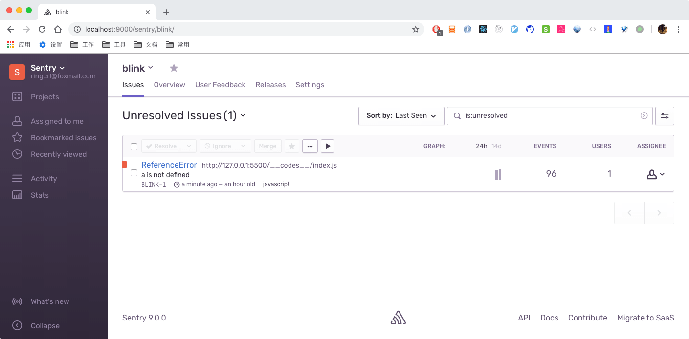

通过 docker 搭建自己的 Sentry 前端错误监控系统。

# 官方版本

## 注册账号

https://sentry.io/signup/

## 接入 SDK

```html
<script
  src="https://browser.sentry-cdn.com/4.4.2/bundle.min.js"
  crossorigin="anonymous"
></script>
```

## 配置 SDK

Project => Client Keys(DSN)

```js
Sentry.init({
  dsn: "https://cbff6199b6ad435a992352b62a511419@sentry.io/1361279",
});
```

# 搭建 Sentry 服务

## 注意事项

- 服务器的内存至少 2G，否则在执行 `sentry upgrade` 命令时会出现问题。
- 所有命令在 `sudo` 权限下执行，否则 Docker 无法运行

## Docker 环境

### Mac

Mac 环境，直接官网下载 .pkg 文件进行安装。

```sh
docker --version
# Docker version 18.06.1-ce, build e68fc7a

docker-compose --version
# docker-compose version 1.22.0, build f46880f
```

### Linux

```sh
# 安装 Docker
yum install docker -y

# 安装 Docker-Compose
pip install docker-compose

# 启动 Docker
systemctl start docker
```

## 开始搭建

### sentry-onpremise

```sh
git clone https://github.com/getsentry/onpremise.git
```

### 创建服务端服务

```sh
# 进入 onpremise 项目
cd onpremise

# 新建本地数据库和 Sentry 配置的目录
docker volume create --name=sentry-data && docker volume create --name=sentry-postgres

# 创建环境变量配置文件
cp -n .env.example .env

# 构建 Docker Services
docker-compose build

# 生成秘钥
docker-compose run --rm web config generate-secret-key

# 复制秘钥(即最后一行)，编辑 .env 文件，将 SENTRY_SECRET_KEY 对应的 value 修改为刚才复制下来的秘钥
vim .env

# 创建数据库，生成管理员账号
docker-compose run --rm web upgrade

# 启动 Sentry 服务
docker-compose up -d

# 查看容器
docker-compose ps
```

### 配置系统

访问 `localhost:9000` 即可访问服务：

- Root URL: 绑定本 Sentry 服务的域名或者直接填写本服务的 IP
- Admin Email: 系统管理员的邮件地址

重新配置：

- Admin => Settings => General => Root URL(http://172.16.x.xxx:9000)

### 删除服务

```sh
# 停止所有运行
docker-compose down

# 移除所有 volume
docker volume prune
```

### 客户端接入

```html
<script src="https://cdn.ravenjs.com/3.26.2/raven.min.js" crossorigin="anonymous"></script>

<script>
  /* global Raven */
Raven.config('http://836ba361451c42bca8134d49d0bbf929@172.16.x.xxx:9000/2').install();

console.log(a); // 用于报错验证
<script>
```

## sentry-cli

可用于配置 SourceMap、控制 Release 等。

### 安装

```sh
npm install sentry-cli-binary -g
```

### 生成 token

`User settings => API => Auth Tokens => Create New Token` 生成 token，注意要勾选 project:write，开启项目的写权限。


### 登录 cli

```sh
sentry-cli --url http://127.0.0.1:9000 login

# 注意要制定 --url，否则会指到官网
# 输入上一步生成的 token
```

### 默认组织与项目

`-o xxx -p xxx` 很麻烦，可以通过修改 `~/.sentryclirc` 添加默认组织与项目。

```sh
[auth]
token=YOUR API TOKEN

[defaults]
url=服务器
org=组织
project=项目
```

### 了解更多

https://docs.sentry.io/cli/

## relese 控制

### 创建 release

```sh
sentry-cli releases -o sentry(组织名称) -p blink(项目名称) new dev@1.0.0
```

### 客户端配置

```js
Raven.config("http://836ba361451c42bca8134d49d0bbf929@172.16.x.xxx:9000/2", {
  release: "dev@1.0.0",
}).install();
```

### 删除 release

```sh
sentry-cli releases -o sentry(组织名称) -p blink(项目名称) delete dev@1.0.0
```

## SourceMap

### 本地上传

```sh
sentry-cli releases \
-o sentry(组织名称) \
-p blink(项目名称) \
files dev@1.0.0 \
upload-sourcemaps mapfile_path \ # 对应 sourcemap 文件的本地路径
--url-prefix online_path # 对应的是线上 JS 文件的目录，例如 ~/static/js/
```

### 删除所有

```sh
sentry-cli releases files dev@1.0.0 delete --all
```

## 主动捕获错误

定时器、接口请求错误等【异步错误】，需要利用 raven.caputureException() 进行主动上报。

```js
// 接口请求
axios
  .get("/user?ID=12345")
  .then(function (response) {
    console.log(response);
  })
  .catch(function (error) {
    window.$Raven.captureException(error);
  });

// 定时器任务
setTimeout(() => {
  try {
    // do something
  } catch (err) {
    window.$Raven.captureException(err);
  }
}, 300);
```

## 邮箱设置

在搭建好的 Sentry 的 Web 页面中无法配置邮箱 smtp 信息，需要修改配置文件 config.yml。

### config.yml

```sh
###############
# Mail Server #
###############

mail.backend: 'smtp'  # Use dummy if you want to disable email entirely
mail.host: 'smpt.gmail.com' # 输入邮箱 smpt 服务器地址
mail.port: 25
mail.username: ''
mail.password: ''
mail.use-tls: false
```

### docker-compose.yml

为其中的 Web 容器添加 volumes 卷，使得 config.yml 修改生效

```yml
  web:
    <<: *defaults
    ports:
      - '9000:9000'
    volumes:
      - ./config.yml:/etc/sentry/config.yml
```

### 重启服务

```sh
docker-compose up
```

### 邮件发送规则

New Alert Rule，如果不想发送测试版本的数据，设置 `Release: staging` 即可。

## 配置插件-钉钉

```sh
# 下载 sentry-dingding
pip install sentry-dingding

# 编辑插件列表
vim requirements.txt
# Add plugins here
sentry-dingding~=0.0.1
redis-py-cluster==1.3.4

# 重新 build
docker-compose build
docker-compose up -d
```

# 使用 Sentry

- 进入到后台，开始解决报错
- 通过 SourceMap 快速定位到源码
- 通过 Breadcrumbs 查看报错前的用户操作
- 查看详细的系统信息




