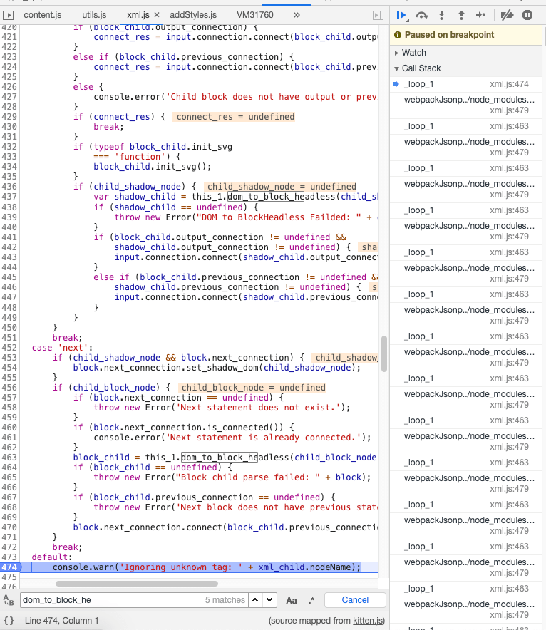
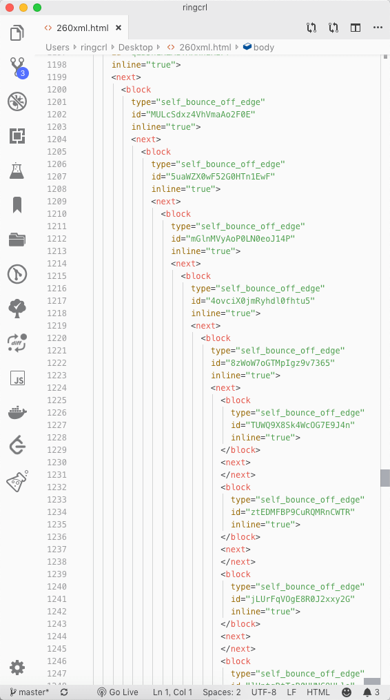
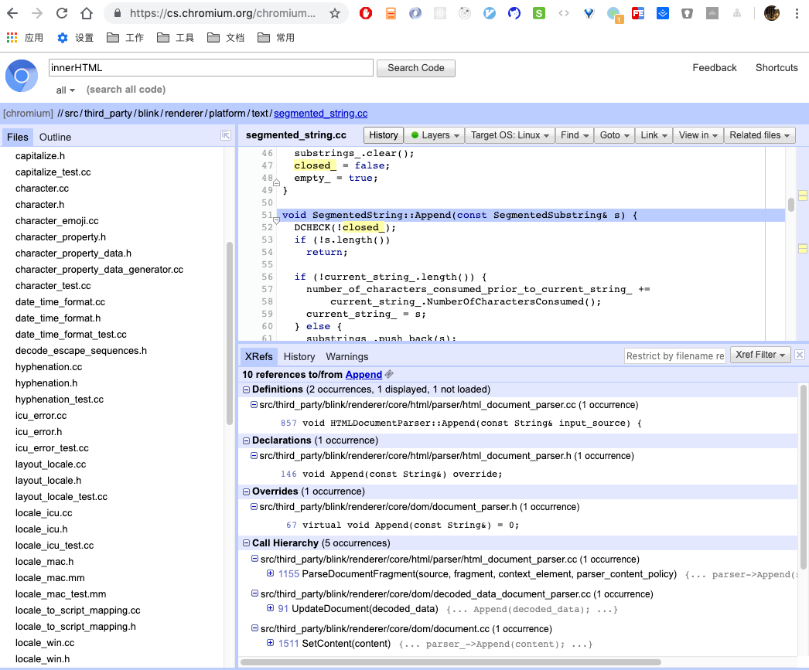

- `new DOMParser.parseFromString(xml, 'text/html')` 的最大深度是 512，大于之后会把更深层次的 DOM 节点拍平到最后一层？
- 上古时代 JQ 用法 `$('<div></div>').html(xml).get(0)` 走的是上面的流程？
- 如何超出这个限制？


有个疑难杂症，产品说如果积木量达到 2000 多块的时候，保存后再重新打开，会出现积木丢失的情况。这个 2000 多还不是个定数，某些卡口积木的组合达到 4000 多的时候出现。

这时候建立一个最简复现模型如上图，发现只要 256 块连续拼接的积木即可复现，所有超出的积木最后都无法渲染出来。第一时间查询了一下保存下来的数据结构，发现是正确的，没有数据丢失，渲染的方法出的问题。

开始还以为是在递归中出现了问题，发现传入积木代码区的 DOM 节点是有问题的：



回到主项目，发现一行这样的代码 `dom_to_workspace($('<div></div>').html(xml).get(0))`

难道是 JQ 往数据里面灌屎了，把数据复制出来看看



理论上最后的数据应该是继续嵌套下去的，怎么被拍平了？先把上古时代的 JQ 代码去掉，使用 DOMParser 试试看：

```js
const dom_parser = new DOMParser();
dom_parser.parseFromString(xml, 'text/html');
// ...
```

再看看结果，结果一样？也就是 `innerHTML` 的结果和 `parserFromString(xml, 'text/html')` 用了同一套处理逻辑？一脸懵逼中，这不是没法搞了么。

等等，明明结构是 xml，为什么要使用 `text/html` 来解析呢？

```js
const xml_text = `<xml>${xml}</xml>`;
const parser = new DOMParser();
const dom = parser.parseFromString(xml_text, 'text/xml').childNodes[0] as Element;

Bridge.dom_to_workspace(dom);
```

修改一下，OK 了，后来发现 JQ 文档里面也是有专门的 xml parser 的方法的，是一开始就不应该用 html 的方法来处理 xml。。。

期间尝试了一下了解 innerHTML 的实现原理，惊为天人的 chromiun 代码。。


